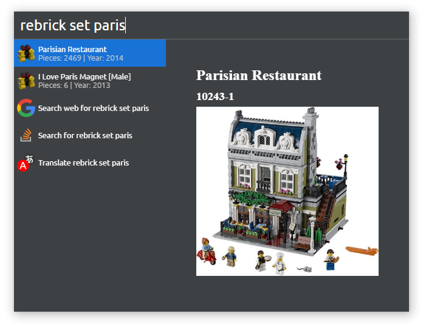

# cerebro-rebrickable

Cerebro plugin to search LEGO® Sets on Rebrickable

## Usage

In Cerebro, type "rebrick set" or "rebrick part" followed by the set/part number, name, theme or subtheme you want to search:

## Roadmap

- [ ] Display **nice** set preview

## License

MIT © [Balint Kovacs](http://bolint.hu)
